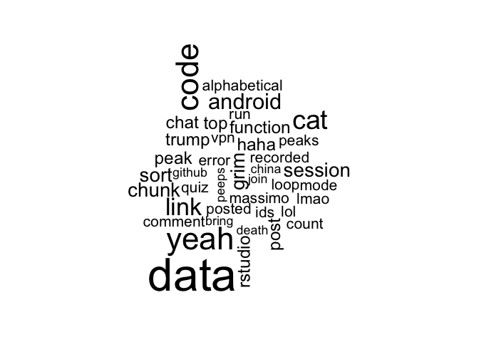
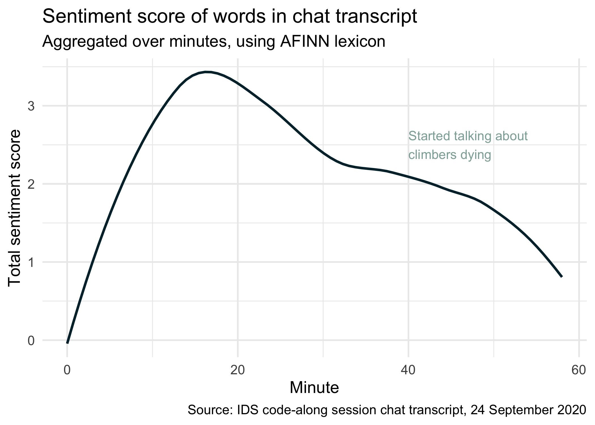

Analysis of code-along session chat transcript
================
Mine Çetinkaya-Rundel
24 September 2020

We’ll start by loading the packages we’ll use in this analysis:

-   **tidyverse** for data wrangling and visualization
-   **tidytext** for text analysis
-   **wordcloud** for making a word cloud
-   **emo** for emojis
-   **lubridate** for working with date/time data

<!-- -->

    library(tidyverse)
    library(tidytext)
    library(wordcloud)
    library(emo)
    library(lubridate)

Next, let’s load the data and give it variable names as the raw data
coming from Zoom doesn’t have them.

    chat <- read_tsv("01-chat.txt", col_names = FALSE)
    names(chat) <- c("timestamp", "name", "message")

92 students participated in the chat during the code along session!

We’ll first take a look at the 10 most commonly said words, excluding
“stop words” – these are words like “the”, “a”, “maybe”. Happy to see my
cat represented in among the most common words. For those who missed the
session, I think some people in the chat were asking me to move so they
could see the cat hiding behind me! 😻.

    chat %>%
      unnest_tokens(word, message)  %>%
      anti_join(stop_words) %>%
      count(word, sort = TRUE)

    ## # A tibble: 414 x 2
    ##    word        n
    ##    <chr>   <int>
    ##  1 data       17
    ##  2 code       11
    ##  3 yeah       11
    ##  4 cat         9
    ##  5 link        8
    ##  6 android     7
    ##  7 chunk       6
    ##  8 grim        6
    ##  9 session     6
    ## 10 sort        6
    ## # … with 404 more rows

We can also make a word cloud of common words.

    chat %>%
      unnest_tokens(word, message)  %>%
      anti_join(stop_words) %>%
      count(word, sort = TRUE) %>%
      with(wordcloud(word, n, ordered.colors = TRUE, max.words = 40))

<!-- -->

Using commonly used lexicons, we can assign “positive” and “negative”
sentiments to each word in the transcript (again, exlcuding stop words).
Data has no sentiment, WHAT?! And cat, COME ON! Obviously cat should
have a positive sentiment associated with it. And “trump” here refers to
Donald Trump. Sentiment assignment for him is contentious, to say the
least…

    chat %>%
      unnest_tokens(word, message) %>%
      anti_join(stop_words) %>%
      count(word, sort = TRUE) %>%
      left_join(get_sentiments("bing")) %>%
      mutate(
        sentiment = if_else(is.na(sentiment), "no sentiment", sentiment),
        sentiment = fct_relevel(sentiment, "positive", "negative", "no sentiment")
        ) %>%
      group_by(sentiment) %>%
      slice_head(n = 5) %>%
      ggplot(aes(y = fct_reorder(word, n), x = n, fill = sentiment)) +
      geom_col() +
      facet_wrap(~sentiment, scales = "free_y") +
      guides(fill = FALSE) +
      labs(
        x = "Frequency",
        y = "Common words",
        title = "Sentiments of words in chat transcript",
        subtitle = "Using Bing lexicon",
        caption = "Source: IDS code-along session chat transcript, 24 September 2020"
      ) +
      theme_minimal(base_size = 14) +
      scale_fill_manual(values = c("#8fada7", "#E9AFA3", "gray"))

Finally, let’s take a look at sentiment score throughout the duration of
the session. We’ll use a different lexicon that gives sentiment scores
instead of positive / negative categorizations, and tally scores per
minute. We’re seeing a downward shift throughout the session, which is a
little worrying. I hope I didn’t confuse people too much! But I should
also note that around the 40 minute mark we started talking about people
dying during Himalayan expeditions. So, it’s not surprising that the
sentiment score started dipping.

    chat %>%
      unnest_tokens(word, message) %>%
      anti_join(stop_words) %>%
      left_join(get_sentiments("afinn")) %>%
      filter(!is.na(value)) %>%
      mutate(timestamp_min = minute(timestamp)) %>%
      group_by(timestamp_min) %>%
      summarise(total_sentiment_score = sum(value)) %>%
      ggplot(aes(x = timestamp_min, y = total_sentiment_score, group = 1)) +
      geom_smooth(se = FALSE, color = "#002b36") +
      labs(
        x = "Minute",
        y = "Total sentiment score",
        title = "Sentiment score of words in chat transcript",
        subtitle = "Aggregated over minutes, using AFINN lexicon",
        caption = "Source: IDS code-along session chat transcript, 24 September 2020"
        ) +
      theme_minimal(base_size = 14) +
      annotate(geom = "text", x = 40, y = 2.5, hjust = 0,
               label = "Started talking about\nclimbers dying",
               color = "#8fada7")

<!-- -->
